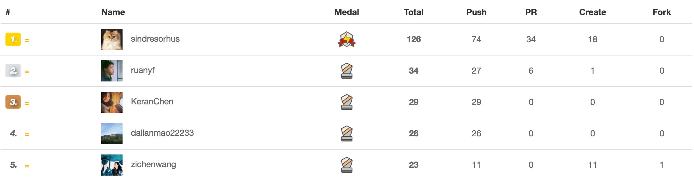

# taige_markdown
Taige Markdown for 11/22/2016

## 新的的太阁极客榜单的宗旨:
Hello 各位读者老爷大家好，欢迎选择点开阅读本期的太阁极客榜（11/16/2016 - 11/22/2016），本周我们改动了极客榜的排名机制，主要是按照大家主页的开源的小格子数目来排序，这样做可以鼓励更多的开发者将自己的项目公布出来给大家看，真正实践互联网共享精神，共同学习，共同进步。

全新的每周太阁极客榜报道仍将致力于实现以下三个原则：

1.满目玲琅: 报道Github的开发者们近期在开发什么类型的项目

2.按图索骥: 上榜单开发者们在用什么技术, 这个技术在当下技术栈的定位。

3.抛砖引玉: 希望各位有心的读者能从这份小小的榜单中得到下一步开发之道的灵感。

以上三个宗旨将随着接下来几次榜单的报道而分步完成, 也请各位读者持续关注我们太阁极客榜。

### 第一名: [sindresorhus](https://github.com/sindresorhus)

第一位仍然是尽管统计方式改变，但是排名依然不变的传说中的开发者，sindresorhus，接下来让我们看看他在这周的开发进展吧。

* [negative-zero](https://github.com/sindresorhus/negative-zero), 项目的目的是判断检查一个数字是否为[negative zero](https://en.wikipedia.org/wiki/Signed_zero)。

* [positive-zero](https://github.com/sindresorhus/positive-zero)项目, 这个项目的目标是判断检查一个数字是否为[positive zero](https://en.wikipedia.org/wiki/Signed_zero)。

* [os-locale](https://github.com/sindresorhus/os-locale)项目, 项目的目的是Getting the system locale, which is useful for localizing your module or app.。

* [tab-size-on-github](https://github.com/sindresorhus/tab-size-on-github)项目, 这是一个chrome的插件应用, 功能是让你在使用tab缩进的时候一次缩进4个字符长度, 而不是八个字符, 使得程序更有可读性。

* [todomvc-common](https://github.com/tastejs/todomvc-common)项目, 项目的目的是提供Common TodoMVC utilities used by our apps。

* [ava](https://github.com/avajs/ava)项目, 项目的目的是利用Node.js的异步执行的优点让你的测试可以并发执行，这对于 IO 繁重的测试特别有用。这是个规模挺大的项目，而且readme被翻译成了多种语言，附上[中文版链接](https://github.com/avajs/ava-docs/blob/master/zh_CN/readme.md)

* [file-url-cli](https://github.com/sindresorhus/file-url-cli)项目, 项目的目的是把一个path转化成file url，例如：unicorn.jpg → file:///Users/sindresorhus/unicorn.jpg

* [p-forever](https://github.com/sindresorhus/p-forever)项目, 项目的主要内容是 Run promise-returning & async functions until you end it。

* 限于篇幅，就先po出这些项目的介绍，下图显示了在过去的一周每天提交的commit的数目：

### 第二名: [xinyzhang9](https://github.com/xinyzhang9)

第二位是一个特别有创造力且特别勤勉的开发者，[这是](https://xinyzhang9.github.io/)他的个人作品主页，小编强烈建议各位读者点进去玩一下，很多非常有趣的项目，而且与用户的互动性很强，另外，每一个项目的名字起的也别具匠心。

下面让我们来看看他在过去的一周主要参与了哪些开发项目吧。

* [Movie Recommender using ReactiveX](xx)项目, 项目的主要内容是

* [xx](https://github.com/xinyzhang9/movie_recommender)项目, 项目的主要是基于ReactiveX建立的一个电影推荐应用。

* [xinyzhang9.github.io](https://xinyzhang9.github.io/)项目, 更新了自己的个人主页。

* [Pokemon Visualizer](https://github.com/xinyzhang9/pokemon_visualizer)项目, 项目的主要是建立一个精灵可乐梦的可视化地图应用。

* [Learn Python and Django](https://github.com/xinyzhang9/python_master)项目, 项目的主要是在学习用Python刷算法题。

### 第三名: [ruanyf](https://github.com/ruanyf)
榜单上的第三名是上周榜单的第二名的阮一峰, 他这一周主要的工作内容依然是著书。

这位开发者在过去一周主要从事的开发活动有：

* [全栈工程师培训材料](https://github.com/ruanyf/jstraining)项目,  作者自己的介绍是: “帮助学习者掌握全栈开发的基本知识，承担简单 Web 应用的前后端开发。”

* [“jstutorial”](https://github.com/ruanyf/jstutorial)项目, 这是一本开源的js教程书, 主要关注点是客户端的设备方面的开发。

* [“react-babel-webpack-boilerplate”](https://github.com/ruanyf/react-babel-webpack-boilerplate)项目, 这是一个项目开发模板, 你可以这个模板为基础来开发自己的web应用。

### 第四名: [SimonWang](https://github.com/AssassinW)

第四名的开发者是一位Github主页特别萌的同学, 他在过去的一周内主要更新了自己的[AssassinW/Web](https://github.com/AssassinW/Web)项目, 他自己写的介绍是“This is a project that explores the congress information throught Sunlight API.”，有兴趣的小伙伴可以点开看一下。

### 第五名: [hackjutsu](https://github.com/hackjutsu)

第五位上榜的开发者是我们太阁极客榜的负责人，文哲，他在过去的一周内也是积极参与了自己喜欢的项目的开发，进行的也是有声有色。

* [个人博客](http://hackjutsu.com)项目, 文哲同学的个人博客可以说是干活满满，他用[Hex](https://hexo.io/)搭建了自己的博客系统，致力于进行前端知识的探索和分享，有兴趣的同学不妨关注并订阅一下。

### 结语：
