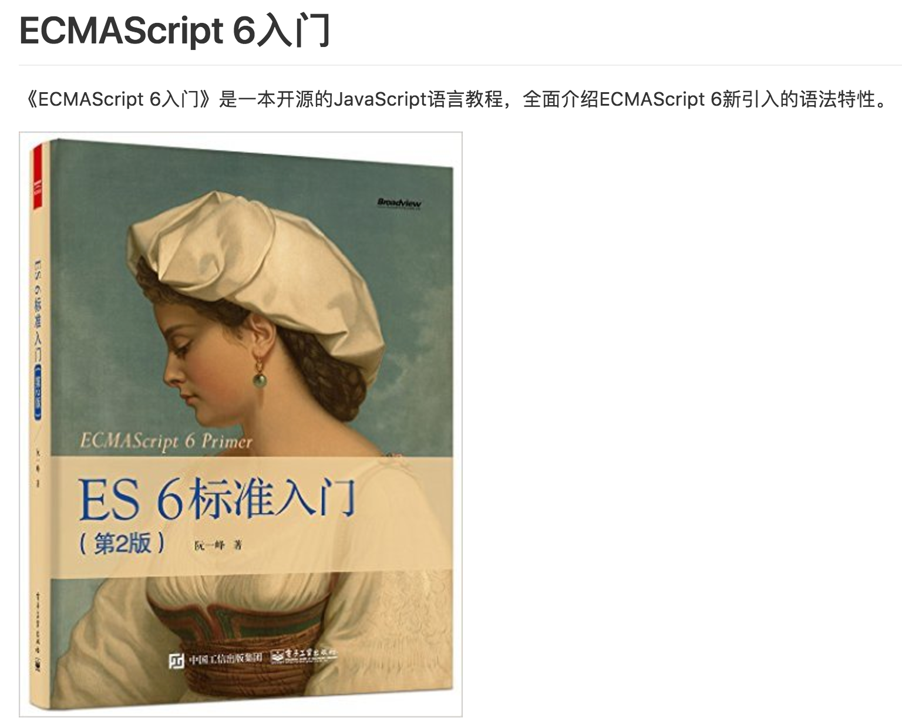

# taige_markdown
Taige Markdown for 11/22/2016

## 新的的太阁极客榜单的宗旨:
Hello 各位读者老爷大家好，欢迎选择点开阅读本期的太阁极客榜（11/16/2016 - 11/22/2016），本周我们改动了极客榜的排名机制，主要是按照大家主页的开源的小格子数目来排序，这样做可以鼓励更多的开发者将自己的项目公布出来给大家看，真正实践互联网共享精神，共同学习，共同进步。

全新的每周太阁极客榜报道仍将致力于实现以下三个原则：

1.满目玲琅: 报道Github的开发者们近期在开发什么类型的项目

2.按图索骥: 上榜单开发者们在用什么技术, 这个技术在当下技术栈的定位。

3.抛砖引玉: 希望各位有心的读者能从这份小小的榜单中得到下一步开发之道的灵感。

以上三个宗旨将随着接下来几次榜单的报道而分步完成, 也请各位读者持续关注我们太阁极客榜。

### 第一名: [sindresorhus](https://github.com/sindresorhus)

第一位仍然是尽管统计方式改变，但是排名依然不变的传说中的开发者，sindresorhus，接下来让我们看看他在这周的开发进展吧。

* [negative-zero](https://github.com/sindresorhus/negative-zero), 项目的目的是判断检查一个数字是否为[negative zero](https://en.wikipedia.org/wiki/Signed_zero)。

* [positive-zero](https://github.com/sindresorhus/positive-zero)项目, 这个项目的目标是判断检查一个数字是否为[positive zero](https://en.wikipedia.org/wiki/Signed_zero)。

* [os-locale](https://github.com/sindresorhus/os-locale)项目, 项目的目的是Getting the system locale, which is useful for localizing your module or app.。

* [tab-size-on-github](https://github.com/sindresorhus/tab-size-on-github)项目, 这是一个chrome的插件应用, 功能是让你在使用tab缩进的时候一次缩进4个字符长度, 而不是八个字符, 使得程序更有可读性。

* [todomvc-common](https://github.com/tastejs/todomvc-common)项目, 项目的目的是提供Common TodoMVC utilities used by our apps。

* [ava](https://github.com/avajs/ava)项目, 项目的目的是利用Node.js的异步执行的优点让你的测试可以并发执行，这对于 IO 繁重的测试特别有用。这是个规模挺大的项目，而且readme被翻译成了多种语言，附上[中文版链接](https://github.com/avajs/ava-docs/blob/master/zh_CN/readme.md)

* [“xxx”](xxx)项目, 项目的目的是xxx。

* [“xxx”](xxx)项目, 项目的目的是xxx。

* [“xxx”](xxx)项目, 项目的目的是xxx。

* [“xxx”](xxx)项目, 项目的目的是xxx。

* [“xxx”](xxx)项目, 项目的目的是xxx。

### 第二名: [ruanyf](https://github.com/ruanyf)
榜单上的第二名是在国内开发者中非常有名的阮一峰, 大家可以自行在百度或者知乎上搜索他的个人资料, 那么让我们来看看这位开发人员上周的成果吧。

这位开发者在过去一周主要从事的开发活动有：

* [“ECMAScript 6入门”](https://github.com/ruanyf/es6tutorial)项目,  作者自己的介绍是: “《ECMAScript 6入门》是一本开源的JavaScript语言教程, 全面介绍ECMAScript 6新引入的语法特性。”

* [“jstutorial”](https://github.com/ruanyf/jstutorial)项目, 这是一本开源的js教程书, 主要关注点是客户端的设备方面的开发。

* [“react-babel-webpack-boilerplate”](https://github.com/ruanyf/react-babel-webpack-boilerplate)项目, 这是一个项目开发模板, 你可以这个模板为基础来开发自己的web应用。

* [“Flux demo”](https://github.com/ruanyf/extremely-simple-flux-demo)项目,  这个项目的目的是帮助大家学习Flux的结构。

* [“jstutorial”](https://github.com/ruanyf/jstutorial)项目, 这是一本开源的js教程书, 主要关注点是客户端的设备方面的开发。

* [“jstraining”](https://github.com/ruanyf/jstraining)项目, 项目本身作为全栈工程师的培训材料, 可以帮助读者掌握全栈开发所需要的基本知识。

* [“webpack-demos”](https://github.com/ruanyf/webpack-demos)项目, 这个项目中收录了很多webpack的简单demo。

### 第三名: [KeranChen](https://github.com/KeranChen)

开发者并未公开近期开发的github数据, 小编暂时就不详细介绍了。

### 第四名: [dalianmao22233](https://github.com/dalianmao22233)

第四名的开发者是一位热衷于分享自己刷题的同学, 他在过去的一个月内几乎每周都有四到五天, 每天都在更新自己的[刷题的Repo](https://github.com/dalianmao22233/lintcode), 在此附上链接, 也可以鼓励一下想要一起刷题的小伙伴加入这个行列。

### 第五名: [zichenwang](https://github.com/zichenwang)

这位开发者在过去的两周时间内主要在更新自己的一个叫做[“bloc-jams-angular“](https://github.com/zichenwang/bloc-jams-angular)的项目, 经过小编的了解, 这个项目应该是一门网上实战项目, 想要了解的同学可以到她的Github Repo 去了解。

另外, 上周进入榜单的25名同学中, 小编还想介绍一下一位上升幅度最大的开发者:

### [samli6479](https://github.com/samli6479)

他在过去的两周时间里非常勤奋的学习网页编程开发, 建立了很多Repo, 在这里我们也希望这位开发者可以继续努力, 在网络编程开发的学习道路上继续精进。

### 结语：

暂定以后的榜单也是像今天这样介绍前五名的极客开发者，然后再介绍一名提升幅度最大的同学，相信各位读者也都看到了，保持活跃度是一件很困难，很需要恒心的事情，愿各位“码运昌隆”，我们下期见。
