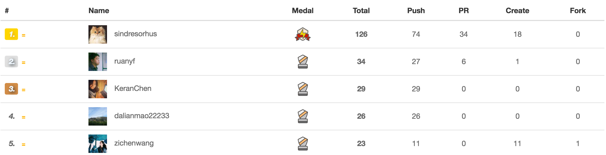

# taige_markdown
Taige Markdown

## 新的的太阁极客榜单的宗旨:
打造一份热衷Coding的极客们的榜单, 反应当下技术流行趋势, 并为读者提供以下信息

1.满目玲琅热衷于Github的开发者们近期在开发什么类型的项目

2.按图索骥: 上榜单开发者们在用什么技术, 这个技术在当下技术栈的定位。

3.抛砖引玉: 希望各位有心的读者能从这份小小的榜单中得到下一步开发之道的灵感。

以上三个宗旨将随着接下来几次榜单的报道而分步完成, 也请各位读者持续关注我们太阁极客榜。

### 第一名: [sindresorhus](https://github.com/sindresorhus)

这是一位常年霸占榜单前三甲的传说级的大牛, 我们可以点开他的Github主页的Organization中, 看到他参与开发了许许多多的前端框架的开发, 那么, 接下来我们来看看他在过去的一周内都参与开发了哪些项目吧。

1. [“Refined－Github”](https://github.com/sindresorhus/refined-github), 项目的目的是简化你的Github的界面, 使用的主要技术有: Javascript和CSS。

2. [“rgb－hex－cli”](https://github.com/sindresorhus/rgb-hex-cli)项目中, 这个项目的目标是实现RGB到HEX的转化。

3. [“p－lazy”](https://github.com/sindresorhus/p-lazy)项目中, 项目的目的是建立一个“只有在被使用的时候才能触发”的promise。
一次提交: 到[“electron－context－menu”](https://github.com/sindresorhus/electron-context-menu)的项目中,  目的是为[Electron](http://electron.atom.io/)的应用添加一个“环境菜单”, 方便用户进行“复制－剪切－粘贴”等操作。
一次提交: 到[“p－defer”](https://github.com/sindresorhus/p-defer)项目中, 项目旨在于创建一个推迟触发的promise。

11/08/2016:

四次提交: 到[“camelcase”](https://github.com/sindresorhus/camelcase)项目中,  项目目的是实现一个这样的功能: “将带有‘横线／单点／下划线／空格’的文字符号转化成驼峰式命名法”。
一次提交: 到[“alfred－npms”](https://github.com/sindresorhus/alfred-npms)项目中,  目的是实现一个[Alfred](https://www.alfredapp.com/)的插件, 能够做到从npm的包中进行搜索。
一次提交: 到[“normalize－url”](https://github.com/sindresorhus/normalize-url)项目中, 这个项目可以帮助你方便地对url（链接）进行如下操作: 显示／储存／去重／排序／对比。
一次提交: 到[“tab－size－on－github”](https://github.com/sindresorhus/tab-size-on-github)项目中,  这是一个chrome的插件应用, 功能是让你在使用tab缩进的时候一次缩进4个字符长度, 而不是八个字符, 使得程序更有可读性。

11/09/2016:

四次提交: 到[“gulp－chmod”](https://github.com/sindresorhus/gulp-chmod)项目中,  这是一个与Gulp库相关的, 可以改变文件访问权限的项目。
三次提交: 到[“stringify－object”](https://github.com/yeoman/stringify-object)项目中, 这是一个与yeoman相关的项目, 这个项目的目的是进行字符的处理, 例如: 可以对json object进行格式化, 去除里面的双引号。
三次提交: 到[“gulp-debug”](https://github.com/sindresorhus/gulp-debug)项目中, 这个项目应该是一个小工具, 可以帮助调试文件流, 看看自己的gulp的流程中到底都有哪些文件的参与。
两次提交: 到[“shell-path”](https://github.com/sindresorhus/shell-path)项目中, 目的是辅助Electron应用的开发。
一次提交: 到[“shell-env”](https://github.com/sindresorhus/shell-env)项目中,  目的是从shell中获得环境变量。
一次提交: 到[“fix-path”](https://github.com/sindresorhus/fix-path)项目中,  目的是在Mac上运行GUI应用的时候可以固定一下$PATH.
一次提交: 到[“Notifier for GitHub”](https://github.com/sindresorhus/notifier-for-github-chrome)项目中,  这是一个Chrome的插件项目, 可以显示你的GitHub的未读信息的数量。

11/10/2016

一次提交: 到[“beeper”](https://github.com/sindresorhus/beeper)项目中, 目的是给你的命令行终端工具添加警报功能。

一次提交: 到自己的一个chrome插件的项目中, 这个项目叫做[link_name](url)“Refined－Github”,  https://github.com/sindresorhus/refined-github,  项目的目的是简化你的Github的界面, 使用的主要技术有: Javascript和CSS。

11/11/2016

三次提交: 到[link_name](url)“p-break ”项目中, https://github.com/sindresorhus/p-break, 目的是打断promise链（开发者自己并不推荐这样做）。
两次提交: 到[link_name](url)“gulp-jsvalidate”项目中, https://github.com/sindresorhus/gulp-jsvalidate,  项目目的是验证Javascript代码, 并报出可能出现的语法错误。
一次提交: 到[link_name](url)“globals”项目中, https://github.com/sindresorhus/globals,  可以作为不同javascript环境的一个“全局标识符”来被使用。
一次提交: 到[link_name](url)“promise-fun”项目中, https://github.com/sindresorhus/promise-fun,
项目的目的本来是整理纪录自己使用过的promise的模块／有用的promise的设计模式／还有如何解决一般常识性的问题。其他人现在可以在这个Repo中看到作者开发过的所有和promise相关的项目。

另外, 小编在翻箱倒柜乱点他的GitHub的时候, 发现了一个很有趣的[link_name](url)Repo, https://github.com/sindresorhus/ama,  是关于他回答各路粉丝问题的, 有兴趣的同学可以看看。

### 第二名: [ruanyf](https://github.com/ruanyf)
榜单上的第二名是在国内开发者中非常有名的阮一峰, 大家可以自行在百度或者知乎上搜索他的个人资料, 那么让我们来看看这位开发人员上周的成果吧。

11/06/2016:

两次提交: 到[“ECMAScript 6入门”](https://github.com/ruanyf/es6tutorial)项目中,  作者自己的介绍是: “《ECMAScript 6入门》是一本开源的JavaScript语言教程, 全面介绍ECMAScript 6新引入的语法特性。”
一次提交: 到[“jstutorial”](https://github.com/ruanyf/jstutorial)项目中, 这是一本开源的js教程书, 主要关注点是客户端的设备方面的开发。

11/07/2016:

两次提交: 到[“react-babel-webpack-boilerplate”](https://github.com/ruanyf/react-babel-webpack-boilerplate)项目中, 这是一个项目开发模板, 你可以这个模板为基础来开发自己的web应用。
一次提交: 到[“Flux demo”](https://github.com/ruanyf/extremely-simple-flux-demo)项目中,  这个项目的目的是帮助大家学习Flux的结构。

11/08/2016:

一次提交: 到[“jstutorial”](https://github.com/ruanyf/jstutorial)项目中, 这是一本开源的js教程书, 主要关注点是客户端的设备方面的开发。

11/09/2016:

同昨天。

11/10/2016:

一次提交: 到[“jstraining”](https://github.com/ruanyf/jstraining)项目中, 项目本身作为全栈工程师的培训材料, 可以帮助读者掌握全栈开发所需要的基本知识。

11/11/2016:

一次提交: 到[“webpack-demos”](https://github.com/ruanyf/webpack-demos)项目中, 这个项目中收录了很多webpack的简单demo。

### 第三名: [KeranChen](https://github.com/KeranChen)

开发者并未公开近期开发的github数据, 小编暂时就不详细介绍了。

### 第四名: [dalianmao22233](https://github.com/dalianmao22233)

第四名的开发者是一位热衷于分享自己刷题的同学, 他在过去的一个月内几乎每周都有四到五天, 每天都在更新自己的[刷题的Repo](https://github.com/dalianmao22233/lintcode), 在此附上链接, 也可以鼓励一下想要一起刷题的小伙伴加入这个行列。

### 第五名: [zichenwang](https://github.com/zichenwang)

这位开发者在过去的两周时间内主要在更新自己的一个叫做[“bloc-jams-angular“](https://github.com/zichenwang/bloc-jams-angular)的项目, 经过小编的了解, 这个项目应该是一门网上实战项目, 想要了解的同学可以到她的Github Repo 去了解。

另外, 上周进入榜单的25名同学中, 小编还想介绍一下一位上升幅度最大的开发者:

### [samli6479](https://github.com/samli6479)

他在过去的两周时间里非常勤奋的学习网页编程开发, 建立了很多Repo, 在这里我们也希望这位开发者可以继续努力, 在网络编程开发的学习道路上继续精进。
